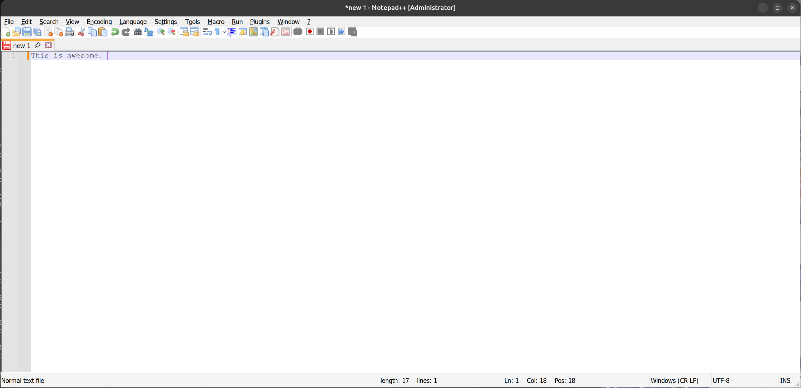
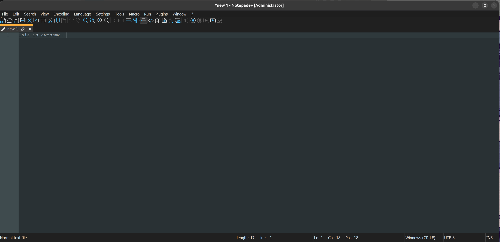

# Notepad++ Flatpak

Unofficial Flatpak packaging of [Notepad++](https://notepad-plus-plus.org/) for Linux, running via Wine.

> **Status:** Unofficial. Not affiliated with or endorsed by the Notepad++ project.

---

## Screenshots

| Light mode | Dark mode |
|---|---|
|  |  |

---

## Requirements

- Flatpak runtime `org.freedesktop.Platform//25.08`
- Wine base `org.winehq.Wine//stable-25.08`
- Wine extensions:
  - `org.freedesktop.Platform.Compat.i386//25.08` (32-bit compatibility)
  - `org.freedesktop.Platform.GL32.default//25.08` (32-bit graphics)
  - `org.winehq.Wine.gecko` (IE engine)
  - `org.winehq.Wine.mono` (.NET runtime)

With the `.flatpakref` install path below, Flatpak resolves these automatically.

---

## Installation

### Recommended (one-command installer)

Download and run the installer script — it installs required Wine extensions from Flathub and then the app:

```bash
bash <(curl -fsSL https://raw.githubusercontent.com/priyanshuz/notepadpp-flatpak/main/install.sh)
```

Or download `install.sh` from [Releases](../../releases) and run:

```bash
bash install.sh
```

### Manual (advanced)

1. Install required Wine runtime extensions from Flathub:

```bash
flatpak install -y flathub \
  org.freedesktop.Platform.Compat.i386//25.08 \
  org.freedesktop.Platform.GL32.default//25.08 \
  org.winehq.Wine.gecko/x86_64/stable-25.08 \
  org.winehq.Wine.mono/x86_64/stable-25.08
```

2. Install the app:

```bash
flatpak install --user https://priyanshuz.github.io/notepadpp-flatpak/com.notepadplusplus.NotepadPlusPlus.flatpakref
```

### First launch

The first launch will:
1. Initialise the Wine prefix.
2. Silently install Notepad++ into the prefix.
3. Link host fonts into the Wine font directory.
4. Apply your configured theme and preferences.

Subsequent launches skip all of the above and start Notepad++ directly.

---

## Configuration

All options are exposed as environment variables. You can set them using [Flatseal](https://flathub.org/apps/com.github.tchx84.Flatseal) or via the command line:

```bash
flatpak override --user --env=OPTION=value com.notepadplusplus.NotepadPlusPlus
```

### Available options

| Variable | Default | Description |
|---|---|---|
| `NPP_WINE_DPI` | `96` | Wine DPI for UI scaling. Increase for HiDPI displays (e.g. `144`, `192`, `240`). |
| `WINE_DARK_THEME` | `NO` | Set to `YES` to enable dark mode and the Obsidian syntax theme. |

### DPI guide

| Display type | Suggested value |
|---|---|
| 1080p standard | `96` |
| 1440p / 24" | `120` |
| 4K / HiDPI | `192`–`240` |

### Dark mode

Setting `WINE_DARK_THEME=YES`:
- Applies a dark colour palette to Wine system UI (title bars, menus, dialogs).
- Enables **Dark mode** in Notepad++ Preferences → Dark Mode (Black tone).
- Sets the **Obsidian** syntax highlighting theme in Style Configurator.

Setting `WINE_DARK_THEME=NO` (default):
- Restores the standard light Windows colour palette.
- Switches Notepad++ back to Light mode.

The theme is only re-applied when the value changes, so switching in Flatseal and restarting the app is all that's needed.

---

## Defaults applied on first launch

These preferences are set automatically and do not change on subsequent launches unless the theme stamp is cleared:

| Setting | Value |
|---|---|
| Preferences → General → Hide right shortcuts | Enabled |
| Preferences → Toolbar | Fluent UI: small |
| Preferences → Editing 1 → Enable smooth font | Enabled |
| Dark Mode | Light (follows `WINE_DARK_THEME`) |
| Style Configurator theme (dark mode only) | Obsidian |

---

## Resetting the Wine prefix

To start fresh (re-runs first-launch setup):

```bash
rm -rf ~/.var/app/com.notepadplusplus.NotepadPlusPlus/data/wine
flatpak run com.notepadplusplus.NotepadPlusPlus
```

---

## Fonts

Host system fonts are automatically linked into the Wine font directory on first launch via `/run/host/fonts` (the standard Flatpak host font path). User fonts from `~/.fonts` are also accessible.

---

## Build locally

```bash
git clone https://github.com/priyanshuz/notepadpp-flatpak.git
cd notepadpp-flatpak

flatpak-builder --user --install --force-clean build-dir \
    com.notepadplusplus.NotepadPlusPlus.yml
```

---

## Automated updates and publishing

This repository is configured to auto-publish whenever upstream Notepad++ releases a new version.

### What is automated

- Upstream version check: `.github/workflows/auto-update-notepadpp.yml` runs every 6 hours.
- Manifest bump: it updates `com.notepadplusplus.NotepadPlusPlus.yml` with the latest installer URL and SHA256 checksums.
- Auto commit + tag: it commits to `main` and pushes a version tag (for example `v8.9.6.1`).
- Flatpak build + Pages publish: `.github/workflows/build.yml` runs on `main` push and publishes:
  - `repo/` to `gh-pages`
  - `com.notepadplusplus.NotepadPlusPlus.flatpakref` to the root of `gh-pages`
- GitHub Release assets: `.github/workflows/build.yml` runs on `v*` tags and uploads:
  - `notepad-plus-plus.flatpak`
  - `com.notepadplusplus.NotepadPlusPlus.flatpakref`
  - `install.sh`

### One-time GitHub settings

- Actions workflow permissions: set to **Read and write**.
- GitHub Pages source: publish from branch `gh-pages`.

### GitHub setup runbook (click path)

1. Open **Settings -> Actions -> General**.
2. Under **Workflow permissions**, select **Read and write permissions**.
3. Save the setting.
4. Open **Settings -> Pages**.
5. Under **Build and deployment**, choose:
  - **Source**: `Deploy from a branch`
  - **Branch**: `gh-pages`
  - **Folder**: `/ (root)`
6. Save and wait for the first successful publish.
7. Optional verification:
  - Run **Actions -> Auto Update Notepad++ -> Run workflow**.
  - Confirm the `Build and Publish Flatpak` workflow runs after the bump commit/tag.
  - Open the Pages URL and confirm `com.notepadplusplus.NotepadPlusPlus.flatpakref` is reachable.

---

## Files

| File | Purpose |
|---|---|
| `com.notepadplusplus.NotepadPlusPlus.yml` | Flatpak manifest |
| `notepadplusplus.sh` | Launch script (DPI, theme, first-run setup) |
| `dark-mode.reg` | Wine registry patch for dark UI colours |
| `light-mode.reg` | Wine registry patch for light UI colours |
| `com.notepadplusplus.NotepadPlusPlus.desktop` | Desktop entry |
| `com.notepadplusplus.NotepadPlusPlus.png` | Application icon |

---

## License

Notepad++ is licensed under the [GPL v3](https://www.gnu.org/licenses/gpl-3.0.html).  
This packaging is provided as-is with no warranty.
